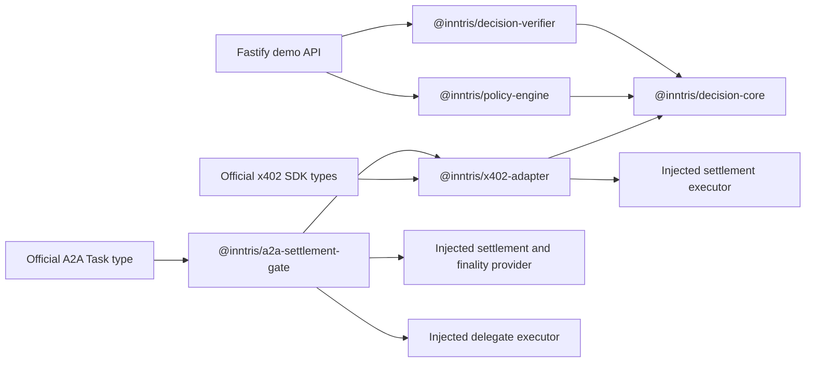

# Architecture

## Design objective

The adapter creates portable proof that organisational policy authorised one exact proposed payment.
It keeps policy evaluation, evidence verification and payment settlement separate.

## Trust boundaries

1. The agent and x402 challenge are untrusted input.
2. The Inntris decision provider is trusted to evaluate policy but its response is still verified
   locally.
3. The key registry is an explicit trust root selected by the verifier or operator.
4. The nonce store is trusted to provide atomic single-use consumption.
5. The payment executor is the final enforcement boundary.
6. The facilitator and settlement rail remain outside Inntris.

## Module boundaries



`decision-core` has no x402 dependency. Rail-specific packages construct a common `InntrisActionV1`,
while the decision and verifier remain rail independent.

## Action hash

The authoritative action hash is:

```text
"sha256:" + lowercase_hex(SHA-256(RFC8785_JCS(InntrisActionV1)))
```

The strict schema is applied before canonicalisation. The action includes principal, agent, rail,
transaction, resource, scheme and both available x402 digests.

## Policy hash

YAML or JSON is parsed and validated first. The policy hash covers the resulting object, not the
source text:

```text
"sha256:" + lowercase_hex(SHA-256(RFC8785_JCS(validated_policy_object)))
```

Comments, indentation and mapping order therefore do not change the policy hash.

## Decision fingerprint and signature

Circular hashing is avoided with two explicit preimages:

1. Construct the decision without `decision_fingerprint` and without `signing.signature`.
2. Include `signing.alg` and `signing.key_id`.
3. JCS canonicalise that fingerprint payload and calculate the SHA 256 fingerprint.
4. Insert `decision_fingerprint`.
5. JCS canonicalise the complete decision without `signing.signature`.
6. Sign those bytes with Ed25519.
7. Insert the base64url signature.

The signed decision is immutable. A human approval produces a new decision whose
`supersedes_decision_id` points to the earlier `REQUIRE_APPROVAL` decision.

## Evaluation precedence

1. Invalid structure is a technical error.
2. Explicit deny entries.
3. Network, asset, payee, resource and purpose restrictions.
4. Per-transaction limits.
5. Daily cumulative limits.
6. Time restrictions.
7. Human approval thresholds.
8. Explicit merchant allow.
9. Default block.

A deny always overrides approval or allow.

## Settlement gate

The guard follows this order:

```text
validate x402 challenge
construct exact action
request decision
validate decision schema
verify fingerprint and Ed25519 signature
recalculate action hash
check policy version and expiry
require ALLOW
consume decision
call injected settlement function
```

Every failure stops before settlement. There is no fallback allow path.

## A2A settlement and delegate gate

The A2A package treats the official A2A task ID and context ID as binding inputs. Its
`PAYMENT_SUBMITTED` and settlement states are Inntris adapter contracts, not A2A protocol task
states.

```text
validate A2A task and submitted payment binding
construct the x402 action with a signed-hash A2A extension
request and locally verify the Inntris decision
require ALLOW
settle or confirm the configured finality
reject PAYMENT_SUBMITTED, UNKNOWN, failed or mismatched evidence
reverify the decision after settlement confirmation
consume the decision
claim one delegate execution
execute the delegate
sign the task, payment, settlement and result receipt
```

Settlement uses a deterministic idempotency key. Delegate execution uses a separate atomic claim. A
completed retry returns the stored receipt and result. An unresolved prior delegate claim pauses
instead of risking a second side effect.

## Consumption and partial failure

First consumption succeeds. A retry using the same execution reference returns the original
consumption success. A different reference is a replay conflict.

No generic library can make a database nonce write atomic with every external facilitator. A
production executor must use the same execution reference as the facilitator idempotency key and
reconcile an unknown settlement outcome instead of creating a new execution.

The A2A gate deliberately places consumption after confirmed settlement and before delegate
execution. This protects the paid task rather than using a payment submission as authority. A
production deployment still needs durable execution state and reconciliation when a process fails
after claiming the delegate or after the delegate returns but before the receipt is stored.

## Observability

The metrics abstraction records:

```text
decisions_total{verdict,rail}
decision_latency_ms
verification_failures_total{reason}
replay_attempts_total
```

Fastify logs structured request, decision, verdict, rail, reason, latency, verification and
consumption fields. API keys, bearer tokens, signing seeds and complete payment credentials are not
logged.
