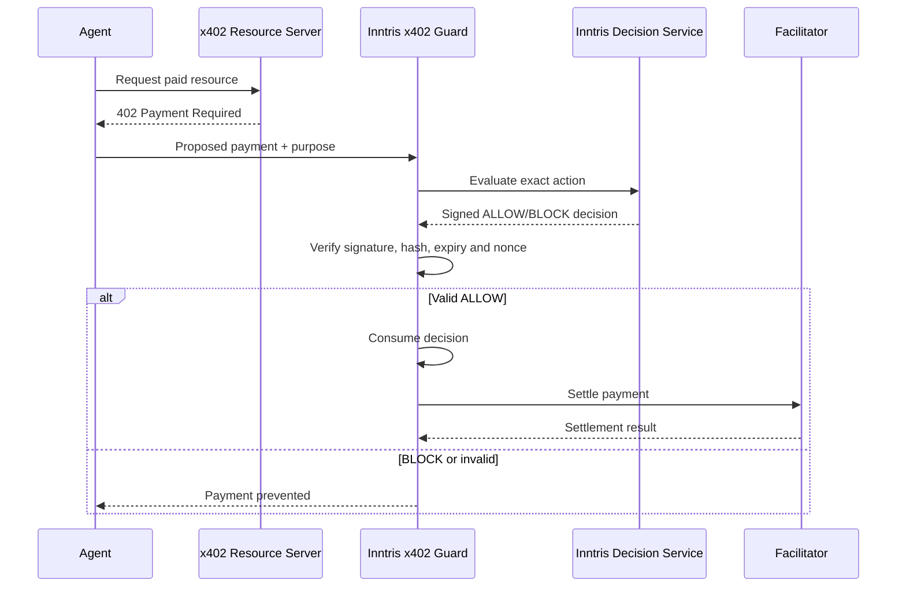

# Inntris Decision Envelope and x402 Policy Adapter

> Inntris does not move money. It proves that the exact payment was authorised by organisational
> policy before another system moves it.

This repository is a public Phase 1 reference implementation of a rail-independent Inntris Decision
Envelope and a fail-closed adapter for the official x402 TypeScript SDK.

Inntris evaluates organisational policy, signs an immutable `ALLOW`, `BLOCK` or `REQUIRE_APPROVAL`
decision, binds it to the exact proposed payment and lets a separate executor consume that decision
once before settlement.

## What this repository proves

1. The same logical action has the same RFC 8785 canonical hash.
2. Any relevant payment change produces a different action or x402 requirements hash.
3. A signed decision can be verified without an Inntris account, API, database or blockchain node.
4. `BLOCK`, `REQUIRE_APPROVAL`, expired, tampered and replayed decisions cannot reach the injected
   settlement function.
5. A successful decision consumption is single use, while a retry with the same execution reference
   is idempotent.

## Product boundary

Inntris:

1. Evaluates organisational policy.
2. Binds the result to the exact proposed action.
3. Signs decisions with Ed25519.
4. Supports local, offline verification.
5. Fails closed before settlement.

Inntris does not hold funds, issue wallets, sign payment transactions, settle payments, act as a
facilitator or replace x402. It does not require Base anchoring for decision validity.

## Five minute quick start

Prerequisites:

1. Node.js `24.18.0`, the pinned active LTS release.
2. pnpm `10.18.1`.

```bash
corepack enable
corepack prepare pnpm@10.18.1 --activate
pnpm install --frozen-lockfile
pnpm demo
```

The demo runs six scenarios without paid services:

```text
Scenario 1: ALLOW; signature valid; decision consumed; settlement permitted
Scenario 2: DECISION_NOT_ALLOW; settlement not called
Scenario 3: DECISION_NOT_ALLOW; settlement not called
Scenario 4: ACTION_HASH_MISMATCH; settlement not called
Scenario 5: NONCE_ALREADY_CONSUMED; settlement not called
Scenario 6: DECISION_EXPIRED; settlement not called
```

## Architecture



The execution boundary is the component that calls the facilitator or payment rail. A decision is
evidence, not execution authority, until that executor verifies and consumes it.

See [ARCHITECTURE.md](ARCHITECTURE.md) for trust boundaries and the fingerprint preimage.

## Packages

| Package                        | Responsibility                                                                         |
| ------------------------------ | -------------------------------------------------------------------------------------- |
| `@inntris/decision-core`       | Strict schemas, JCS, SHA 256 hashes, Ed25519, stable reason codes and replay contracts |
| `@inntris/policy-engine`       | Versioned policy parsing, deterministic evaluation and the local provider              |
| `@inntris/decision-verifier`   | Offline verification library and `inntris-verify` CLI                                  |
| `@inntris/x402-adapter`        | Official x402 type binding, remote provider and fail-closed settlement guard           |
| `@inntris/a2a-settlement-gate` | Finality, consumption, delegate idempotency and signed receipts for paid A2A tasks     |
| `@inntris/demo-api`            | Fastify reference API, key discovery, verification and consumption                     |

The adapter pins `@x402/core` `2.20.0`. It imports `PaymentRequirements` and `PaymentPayload` from
`@x402/core/types` and validates them with the official runtime schemas.

## A2A settlement gate

The follow-on `@inntris/a2a-settlement-gate` package imports the official A2A 1.0 `Task` type from
`@a2a-js/sdk` `1.0.0`. A2A does not define payment submission or settlement finality states, so the
package exposes those as explicit Inntris adapter interfaces.

The gate binds the exact x402 payment to the A2A task, context and resource. It requires a verified
Inntris `ALLOW`, confirms the configured settlement finality, reverifies and consumes the decision,
claims one delegate execution and signs an action receipt. `PAYMENT_SUBMITTED`, `UNKNOWN`, failed,
malformed or mismatched settlement evidence never reaches the delegate.

See [`packages/a2a-settlement-gate/README.md`](packages/a2a-settlement-gate/README.md).

## Verify the committed evidence offline

```bash
pnpm build
node packages/decision-verifier/dist/cli.js decision evidence/allow.json \
  --action evidence/action.json \
  --keys fixtures/keys/registry.json \
  --expected-policy-version 1 \
  --at 2026-07-29T09:30:30.000Z
```

Expected result:

```text
PASS schema
PASS decision fingerprint
PASS Ed25519 signature
PASS action hash
PASS decision expiry at supplied execution time
PASS policy version
PASS x402 payment-requirements binding

VERDICT: ALLOW
DECISION: VALID
```

Other commands:

```bash
node packages/decision-verifier/dist/cli.js hash-action fixtures/actions/allow.json
node packages/decision-verifier/dist/cli.js hash-policy policies/demo-x402-policy.yml
node packages/decision-verifier/dist/cli.js inspect evidence/allow.json
```

The CLI makes no network request by default. A remote registry is only used when the operator
explicitly supplies `--keys-url`.

## Run the reference API

Normal startup never creates a signing key. Generate an explicit development key:

```bash
pnpm keys:generate:dev
```

Then set either `INNTRIS_SIGNING_SEED_BASE64URL` or `INNTRIS_SIGNING_SEED_FILE` and run:

```bash
pnpm demo:api
```

For a disposable local demonstration, explicitly opt into the public fixture identity:

```powershell
$env:INNTRIS_DEMO_MODE = "true"
pnpm demo:api
```

The service exposes:

| Method | Path                             | Purpose                     |
| ------ | -------------------------------- | --------------------------- |
| `GET`  | `/healthz`                       | Non-secret health state     |
| `GET`  | `/.well-known/inntris-keys.json` | Public Ed25519 key registry |
| `POST` | `/v1/decisions/evaluate`         | Signed policy decision      |
| `POST` | `/v1/decisions/verify`           | Local verification result   |
| `POST` | `/v1/decisions/consume`          | Single-use consumption      |

A valid policy `BLOCK` is an HTTP `200` response. HTTP errors represent technical failure, invalid
input, authentication failure or replay conflict.

## Live Inntris mode

`RemoteInntrisDecisionProvider` uses:

```text
INNTRIS_API_URL
INNTRIS_API_KEY
INNTRIS_KEY_REGISTRY_URL
INNTRIS_EXPECTED_POLICY_VERSION
```

It validates the complete response, verifies the signature locally and fails closed when the service
or registry is unavailable. It never falls back to a local allow decision. The example is in
`examples/remote-inntris`.

If the current Inntris production API has a different wire contract, place a translation adapter in
front of this provider. Do not change production endpoints solely to match this repository.

## Decision and money canonicalisation

`InntrisActionV1` rejects unknown fields except the explicit top-level `extensions` object. Monetary
values are decimal strings with at least two fractional digits and no redundant trailing zeroes
beyond the second digit. Therefore `4.50` is valid while `4.5` and `4.500` are rejected.

x402 atomic-unit amounts are converted using the configured asset decimal count. The exact original
x402 requirements remain bound through `payment_requirements_hash`, so conversion does not weaken
the challenge binding.

See [docs/DECISION_ENVELOPE.md](docs/DECISION_ENVELOPE.md) for the complete signed-data contract.

## Security and evidence

1. [THREAT_MODEL.md](THREAT_MODEL.md) documents attacks, mitigations and residual risk.
2. [SECURITY.md](SECURITY.md) documents safe key handling and vulnerability reporting.
3. [docs/EVIDENCE_VERIFICATION.md](docs/EVIDENCE_VERIFICATION.md) explains independent review.
4. [docs/MTP_COMPATIBILITY.md](docs/MTP_COMPATIBILITY.md) distinguishes this envelope from existing
   MTP request hashes and evidence packs.
5. `fixtures/decisions` contains all committed positive and negative test vectors.

## Development commands

```bash
pnpm format:check
pnpm lint
pnpm typecheck
pnpm test:unit
pnpm test:integration
pnpm build
pnpm evidence:verify
pnpm audit --prod --audit-level high
```

## Known limitations

1. The local nonce and decision stores are in-memory reference implementations. A deployment must
   use a durable, atomic store shared by every executor instance.
2. Generic consumption cannot be atomic with every external payment rail. The executor must retain
   the same execution reference, use facilitator idempotency and reconcile a consume-success,
   settlement-unknown outcome.
3. The local spend-state interface demonstrates policy evaluation but is not a distributed ledger.
   Production cumulative limits require an atomic durable spend store.
4. The public fixture signing identity is intentionally known and must never be used in production.
5. No claim is made about HSM custody, disaster recovery, production latency, blockchain finality or
   a live hosted deployment.
6. The `v0.1.0` Phase 1 release supports x402 only. The A2A settlement gate is a later follow-on
   package. AP2, cards, wallet signing and multi-rail conformance remain separate projects.

## Licence

MIT, preserving the licensing decision already present when this repository was created.
